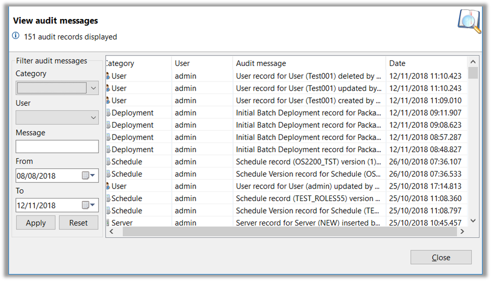

## Deploy Administration - Auditing & Archiving

### Auditing

* OpCon Deploy includes an Audit Capability that captures messages when operations are performed
* These messages include:
    - User
    - Description of Message Capture
    - Time Stamp
* The messages are written into the Audit Table and can be viewed by any Adminstration Role



* Audit Categories
    - Deployment
    - Package
    - Schedule
    - Server
    - User
    - Global Rule
    - Script
    - Transformation Rule

* Audit Messages can be filtered by:
    - Category
    - User
    - Message Content
    - Date Range


### Archiving

* To maintain performance, it is necessary to perform archiving of unused Schedule, Package, and Transformation Rule Versions
    - The number of Versions to keep in the tables is defined in the Global Settings screen

* If a Definition is still marked as **Active**, it cannot be Archived

* The Archive process moves Definitions from the Main Tables to Archive Tables
    - (For Example: ```deploy_schedules``` would be moved to ```archive_deploy_schedules```)

* During the Archiving process, some of the data is normalized
    - For Example: Transformation Rules will be changed to a string of Record IDs, comma separated

* The Archiving Process is performed by three programs executed from the ```DEPLOY_UTILITIES``` Schedule

* ```ArchiveP.SMAOpConDeployClient.exe```
    - Used to perform an Archive of Package Versions no longer required in the ```deploy_package``` table
    - The process checks Schedules and Transformation Rules associated with the Package
    - If the Package is archived, any deployment records that reference the Package Record will also be archived

* ```ArchiveS.SMAOpConDeployClient.exe```
    - Used to perform an Archive of Schedule versions no longer required in the ```deploy_schedule``` table
    - If the schedule is archived, any deployment records that reference the Schedule Record will also be archived

* ```ArchiveT.SMAOpConDeployClient.exe```
    - Used to perform an Archive of Transformation Rule Versions no longer required in the ```deploy_transformation_rule``` table