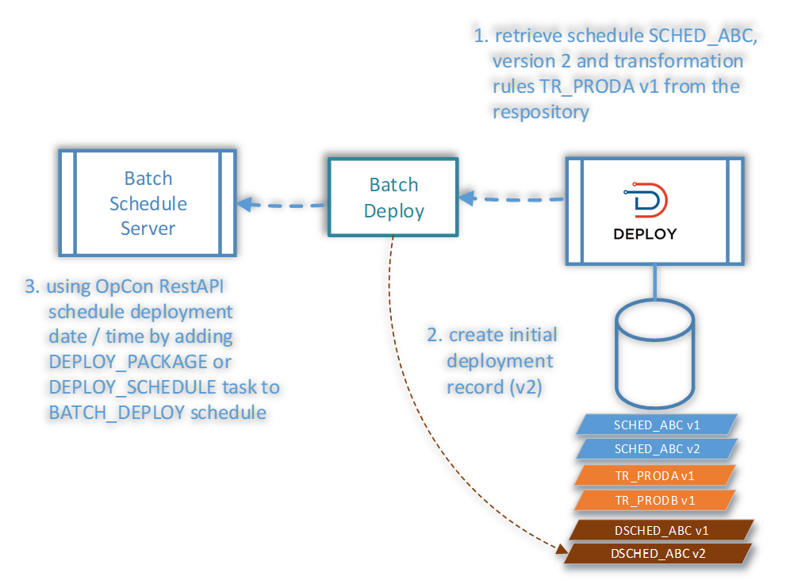
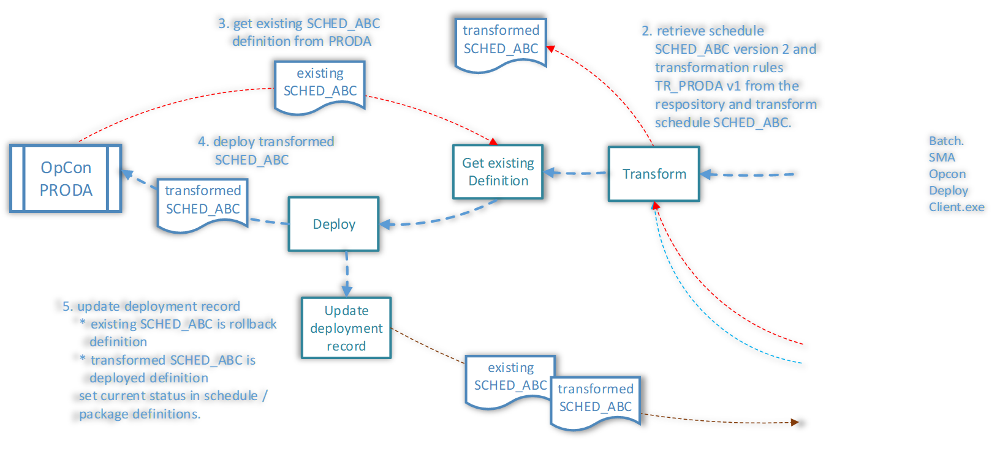
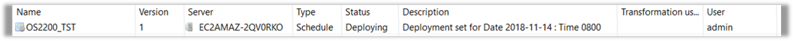

## Deployment - Batch Deployments



###### (Click Images to Enlarge)



* Batch Deployment provides the capability to Schedule Deployment functions into the future using the ```Batch.SMAOpConDeployClient``` Program
    * Requires that the ```BatchScheduleServer``` is configured correctly in OpCon Deploy
    * The ```BATCH_DEPLOY``` Schedule has been deployed to the ```BatchScheduleServer```
    * Required Properties must be set correctly
    * The OpCon Deploy Client software has been installed on the ```BatchScheduleServer```

* Uses the OpCon ```RestAPI``` to check the ```BATCH_DEPLOY``` Schedule is available in the Daily Tables for the required Date
    * If there is no Schedule in the Daily Tables for the required Date, the OpCon ```RestAPI``` will perform a Schedule Build of the ```BATCH_DEPLOY``` Schedule for the required Date
    * Uses the OpCon ```RestAPI``` to add the Schedule or Package Job to the ```BATCH_DEPLOY``` Schedule

* The User must select the Date and Time for the Batch Deployment


* _Password is required_
* This submits an entry into the Deployment Table indicating a future Deployment

