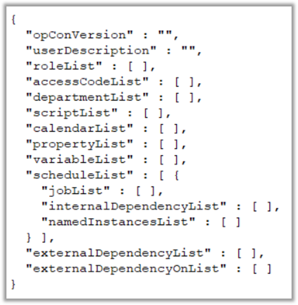

## Deploy - Schedules

* Schedule Definitions must be imported into the OpCon Deploy Repository before Schedules can be deployed or Packages are created
    - Definitions can be imported using the Deploy GUI or the ```Batch.SMAOpConDeployClient.exe``` program
    - A special Batch program can be used to perform an initial population of the Repository from a Production System, inserting the Definitions and creating matching Deployment records

### Schedule Importing

:::note Note
 _Once a Schedule Definition is imported into the Repository it is never modified or overwritten_
:::

* Schedule Definitions are Versioned
* Importing a **New** Definition results in ```Version 1``` being created
* Importing an **Existing** Definition results in a New Version being created ```(Version Number will be Incremented)```

### Schedule Storage

* Schedules are stored in JSON format and contain all information about the Schedule
    - This includes the OpCon Version from which the Schedule was extracted



* Any Roles, Access Codes, Departments, Scripts, Properties, Calendars, and Variables (Resources and Thresholds) found in the Schedule are also included

* The ```ScheduleList``` section of the JSON document includes Schedule Definitions containing Schedule information, Job information, Internal Dependencies, and any Named Instances

* The ```externalDependenciesList``` section includes any External Dependencies that Jobs in the Schedule Definitions have on External Schedules

* The ```externalDependenciesOnList``` section is used when backups are taken and includes Dependencies that Jobs in External Schedules have on Jobs in the Schedule Definitions