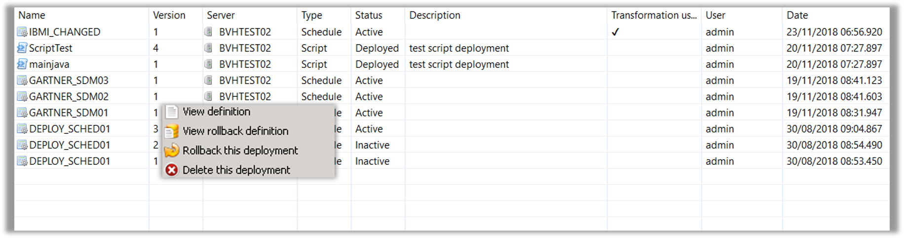
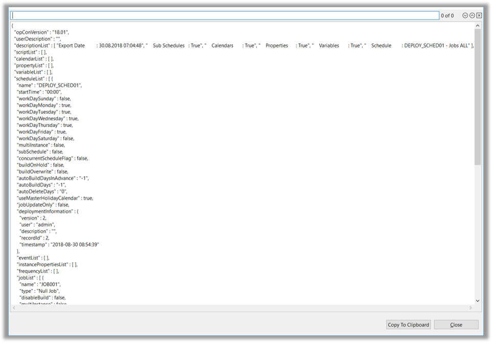

## Overview

* The Browse Function makes it possible for OpCon Deploy Users to view information about Deployments

* Information can be filtered by:
    * **Schedule Name**
    * **Server Name**
    * **Deployment Type** (Schedule, Package, or Script)
    * **Deployment Status** (Active, Deploying, Deployed, Inactive, Deleted, Rolled Back, or Unknown)
    * **OpCon Deploy User**
    * **Date Range**

* Information Displayed:
    * **Name** (Schedule, Package, or Script)
    * **Version**
    * **Server Name**
    * **Type** (Schedule, Package, or Script)
    * **Status** (Active, Deploying, Deployed, Inactive, Deleted, Rolled Back, or Unknown)
    * **Description** (Text entered during Deploy process)
    * **User that performed the Deployment** and **When**

* Actions can be performed on the Deployment Information Screen by Right*Clicking the Record and selecting an Action
    * **View Definition**
        *   Displays the Definition Deployed to the System
    * **View Roll Back Definition**
        * Displays the Backup Definition taken during the Deployment Process
    * **Roll Back the Deployment**
        * Restores the Definition on the System to the Definition taken during the Deployment Process
    * **Delete the Deployment**
        * Removes the Definition from the System
        

