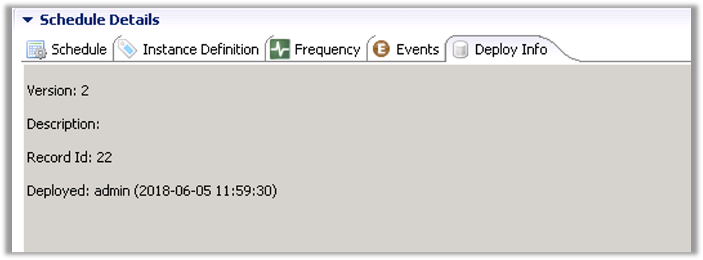

## Overview

* Once Schedule Definitions have been imported into the Repository, they can be Deployed either as a Schedule or part of a Package
* During the Deployment process Transformation Rules can be applied to Definitions for specific Target OpCon Systems
* The Deployment process is performed under Transactional Control

:::note Note
_Any Error Condition will perform a rollback leaving the existing Definition unchanged_
:::

* The Original Definition in the OpCon Deploy Database is not changed
  * Before any changes are made, a backup of the Existing Definition is taken
* During Deployment to a Production System, the Stored Definition and Target System Definition are compared
  * Any existing changes can be viewed and a decision can be made to abort the Deployment or continue
  * 'Local' changes are not lost, but accessible via the Definition Backup (rollback) in the Deployment Record

### Deployment Functions
* ```Deploy```
  * Normal Deployment of a Schedule or Package through the User Interface
* ```Batch Deploy``` 
  * Performs future Deployment using the ```BATCH_DEPLOY``` Schedule
* ```Simulation```
  * Simulates a Deployment by performing a check for errors

### Deploy Info Tab



* Deploy information is written into the **Deploy Info Tab** of **Schedule Details**
* The **Deploy Info Tab** contains:
  * Schedule Version
  * Description
  * Deployment Record ID in the OpCon Deploy Database
  * Which User and Date/Time initiated the Deployment

### Deploy Failures


* Deployment **FAILS** if:
  * SubSchedules are missing
  * Machines are missing
  * Machine Groups are missing
  * Batch Users are missing
  * Optionally if External Dependencies are missing (per Administration Settings)
  * Optionally if Transformation is selected and System does not support Transformation (Per Administration Settings)  