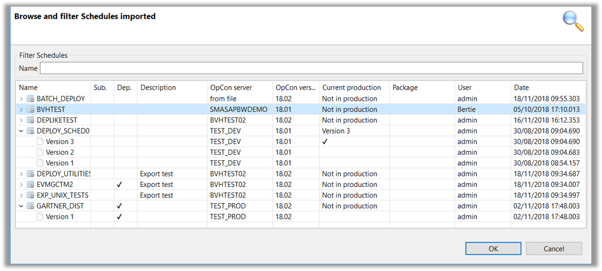
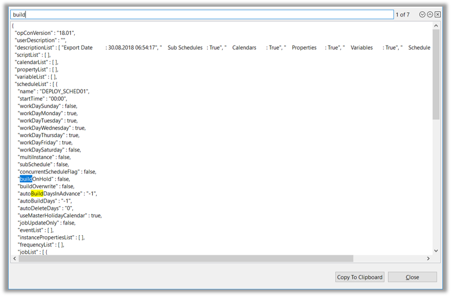

## Overview

* The Browse function allows the OpCon Deploy User to view information about the Schedule Definition in the Repository

## Schedules Import - Browse

* The information displayed in the Browse function consists of:
  * Schedule Name and each Version in the Repository
  * Referenced SubSchedules in the Definition
  * Referenced External Dependencies in the Definition
  * Description entered during the Import Process
  * OpCon System from which the Definition was Imported

* The Definition can also be displayed by Right-Clicking on the Version and selecting **View Definition** in the pop-up

  * Definition will appear in a new pop-up window
  * Contents can be searched by entering a Value in the top search bar
  * Contents can be copied to the clipboard by highlighting what is required and selecting **Copy to Clipboard**

