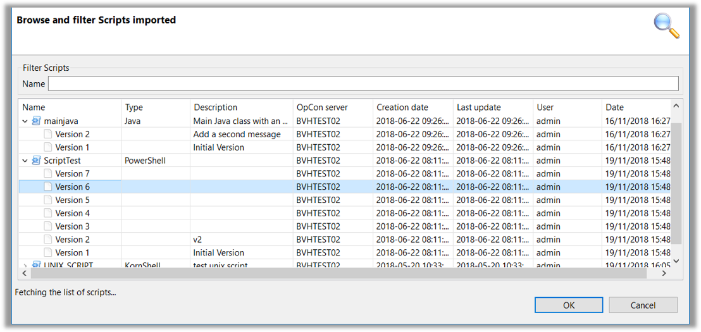

## Overview

* The **Browse** Function allows the OpCon Deploy User to view information about the Script Definition in the Repository

## Script Browse

* The information displayed is:
    * Script Name, Type, and _Each_ Version in the Repository
    * Description entered during Import Process
    * The OpCon System from which the Definition was imported
    * The Script creation Date and Last Update from the OpCon Repository
    * The Deploy User who performed the last action on the Record and Date

* The Definition can also be displayed by Right-Clicking **Version** and selecting **View Script Content** 
    * The Definition will appear in a pop-up window
    * Contents can be searched
    * Contents can be copied to the Clipboard by highlighting desired information and selecting **Copy to Clipboard**

