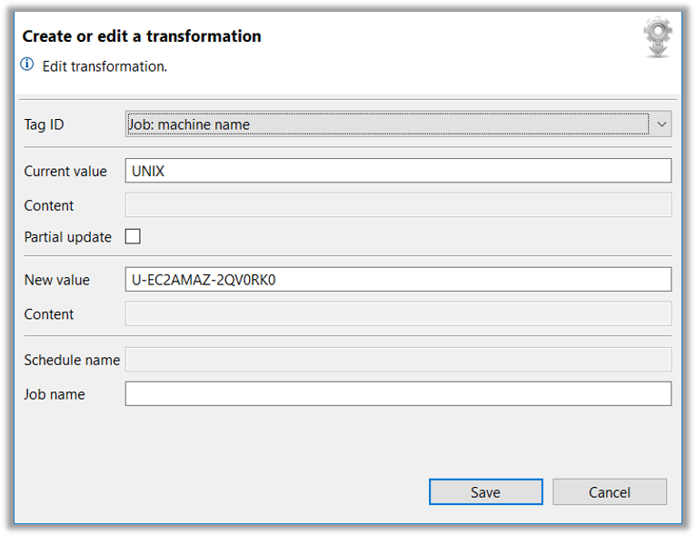

## Deploy - Transformations Functions

### Import File

* Transformation Rules can be created using a Standard Editor and Importing into the Repository with the Import File option


* The Filename will be used as the Default Rule Name
* The contents of the File are **Validated** during the Import Process
* A New Version Number is automatically assigned

### Create/Edit

* The Editor can be used to Create or Update an Existing Rule


* If an Existing Rule is updated, a New Version will be automatically created
* On Startup, an Existing Rule and the Version can be selected
* Once selected, the Rule Definitions are displayed in the Lower Dialog Box

* The contents of an Existing Rule can be modified by selecting the Rule in the Lower Dialog Box and selecting the **Edit** icon
  * The Definition is displayed with all optional fields associated with the **TagID**



* Additional Definitions can be Added using the Green ```(+)``` **Plus** Icon
  * The Required Definition can be selected from the drop-down list
  * All fields associated with the **TagID** are **Enabled**
  * Definitions can be Removed by selecting the Red ```(X)``` Icon 
